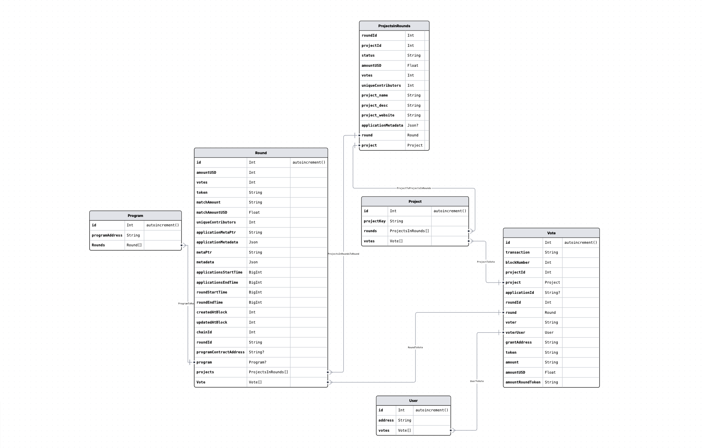
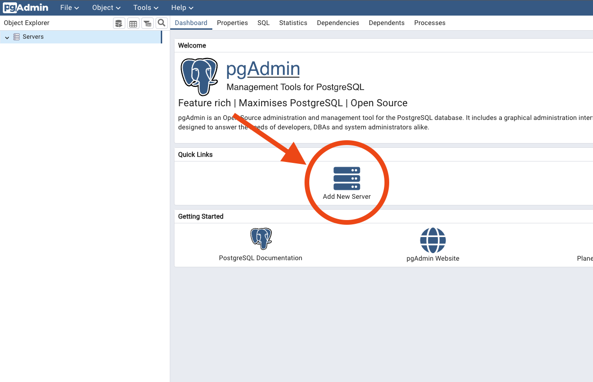
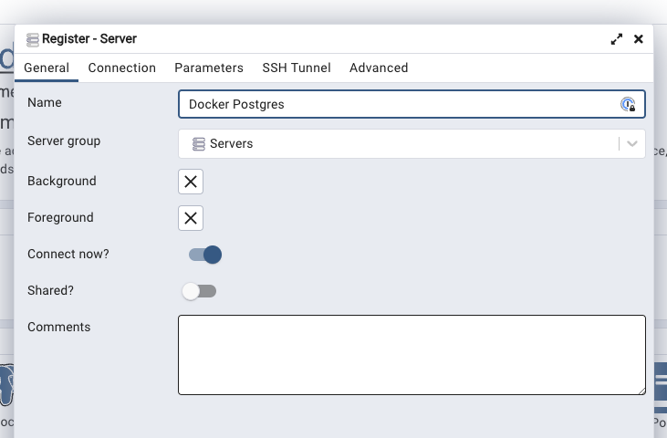
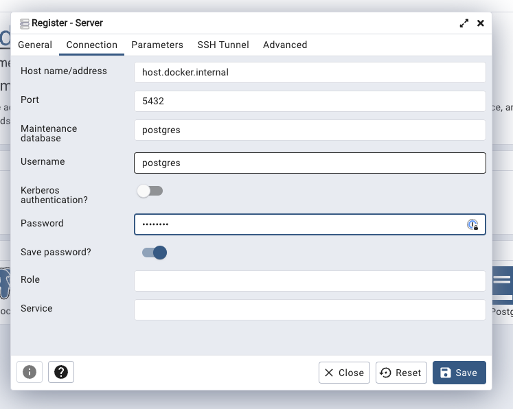
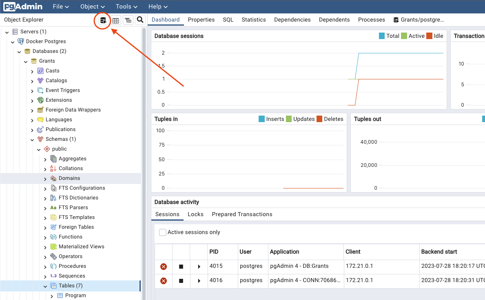

# 🔭 Grants Data cache & ETL Pipeline

> For exploring grants data using SQL queries in Postgres



## Table of Contents

- [🚪 Introduction](#-introduction)
- [🏁 Quick start](#-quick-start)
- [🪄 Run sample query](#-run-sample-query)
- [💪🏾 Local Development](#-local-development)
- [😎 Contribute](#-contribute)

## 🚪 Introduction

This is a NodeJS/typescript ETL framework, powered by the [Allo indexer](https://github.com/gitcoinco/allo-indexer) [data API](https://indexer-grants-stack.gitcoin.co). This ETL pipeline queries the Allo indexer data API and populates the existing Postgres db in docker (see [docker-compose.yml](./docker-compose.yml) file). Database schema is managed using [Prisma](https://www.prisma.io/) (a Typescript ORM).

## 🏁 Quick start

- Install Docker. Visit [https://www.docker.com/](https://www.docker.com/) to install.

- After Docker installation, open Terminal to this repo location and run:

```bash
docker compose up
```

- Once all containers are running and healthy, open `http://localhost:5555` to open PGAdmin.

- Login using default login details:

```
Email: sybilx@supermodular.xyz
Password: admin
```

- Load and configure your server:

| Config Name       | Value                |
| ----------------- | -------------------- |
| Host name/address | host.docker.internal |
| Port              | 5432                 |
| Username          | postgres             |
| Password          | postgres             |





All done 🎉

## 🪄 Run sample query

- Click on the Query tool (image below) and copy any sample query from `./queries` 😉



## 💪🏾 Local Development

You can modify the schema file (located at `./prisma/schema.prisma`) as needed. To kick off indexing for a particular chain, you can run:

```bash
yarn run etl --chain [chainId]
```

Currently available chains are:

| Chain                      | ChainId |
| -------------------------- | ------- |
| Ethereum Mainnet           | 1       |
| Optimism Mainnet           | 10      |
| Fantom Opera               | 250     |
| Public Goods Network (PGN) | 424     |

For more hands-on use cases like creating a custom ETL pipeline like indexing data from the blockchain via RPC using tools like [chainsauce](https://www.npmjs.com/package/chainsauce).

## 😎 Contribute

You can be a cool anon and send in a PR. If you have an SQL query that has helped you and you feel will be helpful to other Anons 👻 and explorers 🔭, feel free to fork this, add it to `./queries`, and send in a PR.
